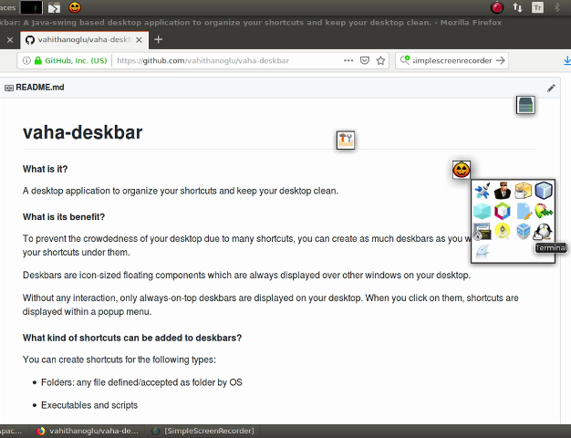
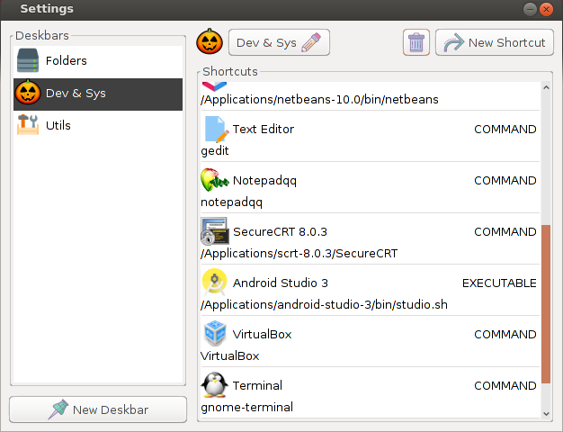

# vaha-deskbar

#### What is it?
A desktop application to organize your shortcuts and keep your desktop clean.

#### What is its benefit?
To prevent the crowdedness of your desktop due to many shortcuts, you can create as much deskbars as you want and group your shortcuts under them. 

Deskbars are icon-sized floating components which are always displayed over other windows on your desktop. 

Without any interaction, only always-on-top deskbars are displayed on your desktop. When you click on them, shortcuts are displayed within a popup menu.

#### What kind of shortcuts can be added to deskbars?
You can create shortcuts for the following types:
- Folders: any file defined/accepted as folder by OS

- Executables and scripts
  - .sh files (on Unix)
  - .app folders (on MacOS)
  - .exe and .bat files (on Windows)

- Custom commands: Any command that can be executed by OS runtime

#### Screenshots

